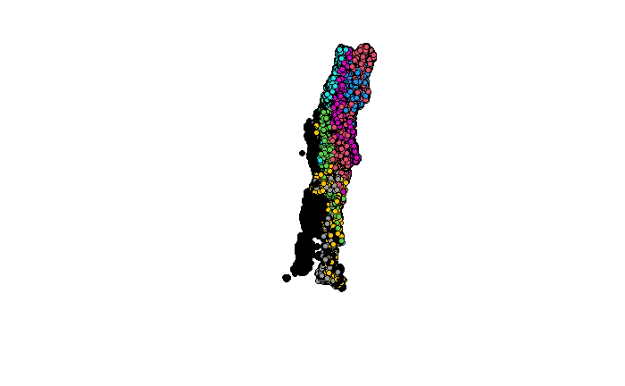

```{r setup, include=FALSE}
knitr::opts_chunk$set(echo = FALSE, message = FALSE, warning = FALSE, error = FALSE, tidy = "formatR", cache = FALSE)
library(caret)
library(tidyverse)
library(raster)
library(sf)
library(gbm)
library(rvest)
library(ggrepel)

URL <- "https://www.worldclim.org/data/bioclim.html"

Coso <- read_html(URL) %>% 
  html_elements("#bioclimatic-variables div") %>% 
  html_text()  %>% str_split(pattern = "\\\r", simplify = T) %>% 
  as.vector() %>% str_split(pattern = "=", simplify = T) %>% 
  as_tibble() %>% 
  mutate_all(str_trim) %>% 
  rename(var = V1, Variable = V2) %>% 
  mutate(var = str_to_lower(var), 
         Variable = str_remove_all(Variable, "\\(.+?\\)"),
         Variable = str_remove_all(Variable, "\\)")) %>% 
  mutate_all(str_trim) %>% 
  mutate_all(~str_wrap(.x, width = 20))


model <- readRDS("~/Documents/Fuego_CI/model_kmeans_noXY.rds")

table_scaled <- readRDS("/home/derek/Documents/Review_and_climate/Climate_Results/table_scaled.rds")

circle <- read_rds("/home/derek/Documents/Review_and_climate/Climate_Results/Circle.rds")
AndList <-  function(x, Sep = "and"){
  x <- sort(x)
  First <- paste(x[-length(x)], collapse = ", ")
  Second <- x[length(x)]
  return(paste(First, Second, sep = str_pad(Sep, str_count(Sep) + 2, "both")))
}

```

# Methods

## Datasets

### Climate change scenarios

In order to evaluate possible scenarios of climate change in the area, we used a polygon comprising the Los Lagos and Los Ríos regions in Chile, and compared them using GCM compareR [@fajardo2020gcm], considering Mean Annual Temperature and Annual Precipitation. The resulting scaled table of comparison among futures was then use to select models to be used in the project.

We used the simple structure index (ssi) as implemented by the Vegan package [@Oksanen_2019; @dolnicar1999tale] to test what number of clusters (Between two and eight), was the best way to represent the 32 Compared GCMs. The best representation was five clusters, from each cluster the GCM closest to the centroid of the cluster was selected. The five selected GCMS were `r AndList(table_scaled %>% dplyr::filter(GCM != "") %>% pull(GCM))` and the selected GCMs together with the clusters are shown in figure \@ref(fig:SelectedGCMs). We used the bioclimatic variables from Chelsa as predictors [@karger2017climatologies], together with the population density extracted from [@ColumbiaUniversity2018].


```{r SelectedGCMs, fig.cap="In this graph we can see the scaled temperature and precipitation axis, the center of the graph represent the ensemble of all models, the five groups represent the clusters selected using kmeans for five groups, the selected GCM of each cluster is shown with a label"}
ggplot(table_scaled, aes(x = x_axis, y = y_axis)) + 
  geom_point(aes(color = Group)) +
  geom_path(data = circle, aes(x = x, y = y)) + 
  coord_equal() +
  geom_text_repel(aes(label = GCM), nudge_y = 0.3) + 
  geom_hline(yintercept = 0, lty = 2) +
  geom_vline(xintercept = 0, lty = 2) +
  theme_bw() +
  labs(x = "Scaled Temperature Axis",
       y = "Scaled Precipitation Axis")
```

## Boosted Regresion Trees

We used boosted regression trees (BRTs) to fit models because they offer several advantages over other regression techniques. BRTs are a type of machine learning technique that seeks to optimize the predictive accuracy of out-of-sample data in an iterative process and using an ensemble of regression trees. By focusing on prediction, BRTs can provide a better estimate of predictive accuracy in contrast to traditional generalized linear models (e.g., linear regression). They tend to avoid including irrelevant variables, and interactions between variables are inherently included without the need to specify them a priori [@Friedman2001-vj; @Friedman2003-tl]. Furthermore BRTs can fit any shape of response, and hence avoid the possibility of underfitting. However, due to this flexibility, cross validation is necessary in order to avoid overfitting. Since BRTs depend on tree-based methods, the number of bifurcations of each variable together with the reduction of the residual error in each of those can be used to calculate the relative influence of each variable [@Friedman2008-ep; @Greenwell2020-lk]. 
For each training set we did a 10 fold structured cross-validation to reduce overfitting, selecting the best model optimizing the value of Root Mean Squared Error (RSME) following [@Kuhn2013-cp] using the caret package [@Kuhn2008-cc] and boosted regression trees through the gbm package [@Greenwell2020-lk].  

## Generated model

We fitted a binomial Boosted Regression Trees, using a 10 fold structured cross-validation, where folds were spatially structured by using K-means were the points of each fold is shown in figure \@ref(fig:kmeans). This arrengement was made in order to diminish overfitting. Ecological data are often autocorrelated—i.e. observations close to each other (in space or time) are more similar than distant ones [@legendre1993spatial]. In our model this is true of the response and the predictor variables. Spatially-separated training and testing datasets can help test whether the model performs as well in nearby locations as it does in more distant places [@telford2009evaluation]. If it does not, structure might not be properly accounted for in the model or the model might be over-fitted to the training data [@Dormann2007methods; @roberts2017cross].

```{r kmeans, fig.cap="Each point is a point used for training, each color is one of the 10 folds for the crossvalidation"}

```

The accuracy of the trained model is 0.89 tested on a 20% leftover points. The 10 most important variables oredered by relative influence are shown in figure \@ref(fig:VarImp), the top 3 variables are markedly higher than the rest, where population, the precipitation of the driest month and temperature seasonality are the most important variables, which has perfect mechanistic sense.

```{r VarImp, fig.cap= "Top 10 variables ordered by relative influence for the Boosted Regression Tree model"}
summary(model$finalModel, plotit = FALSE) %>%
  left_join(Coso) %>% 
  mutate(Variable = ifelse(is.na(Variable), "Population", Variable)) %>% 
  dplyr::slice_max(order_by = rel.inf, n = 10) %>% 
  ggplot(aes(x = reorder(Variable, rel.inf), y = rel.inf)) + 
  geom_col() + 
  coord_flip() +
  labs(x = "Variable",
       y = "Relative influence") +
  theme_bw()
```

# Results

```{r}
Regiones <- getData(name = "GADM", country = "CHL", level = 1)

Regiones <- Regiones %>% st_as_sf() %>% 
  dplyr::filter(NAME_1 %in% c("Los Lagos", "Los Ríos"))

Buffer <- read_sf("/home/derek/Documents/ShapeFilesProyecto/Buffer/Buffer.shp")

Areas<- read_sf("/home/derek/Documents/ShapeFilesProyecto/ParquesNacionales/Parques_Nacionales.shp")
```

In figure \@ref(fig:PredsFire) we see the predicted probability of fire predicted using the model against current conditions and 5 future GCMs for rcp 8.5, this is probably an under prediction, since we changed climate, but we don't have spatial projections on how population will change in the area, and this is the most important variable as seen in figure \@ref(fig:VarImp). This predictions are for all of the Los Lagos and Los Ríos regions, showing the study area as a white polygon.


```{r PredsFire, fig.cap= "Probability of a fire happening within 20 years, for the present and for 5 differet GCMs for 2070 for the Los Lagos and Los Ríos region, in white, the area with the protected areas in the study"}
Predicciones <- readRDS("/home/derek/Documents/Fuego_CI/Predicciones.rds")

Predicciones_sf <- Predicciones %>% 
  as("SpatialPixelsDataFrame") %>% 
  as.data.frame() %>% 
  dplyr::filter(!is.na(Current)) %>% 
  pivot_longer(cols = "Current":"MPI", names_to = "Model", values_to = "Probability") %>% 
  mutate(Model = fct_relevel(Model, "Current"))


ggplot() +
  geom_raster(data = Predicciones_sf, aes(x = x, y = y, fill = Probability))+
  geom_sf(data =Regiones, alpha = 0, size = 0.4) +
  geom_sf(data =Buffer, alpha = 0, size = 0.4, color = "white") +
  facet_wrap(~Model) +
  theme_bw() +
  labs(x = NULL, y = NULL) +
  scale_fill_gradient2(low = scales::muted("blue"), high = scales::muted("red"), midpoint = 0.5) +
  scale_x_continuous(breaks = c(-74.5, -72.5))
```

When we look at the predictions within the study area (figue \@ref(fig:PredsFireFocus) and \@ref(fig:PredsDiff)), we see that in the CESM and IPSL GCMs is there seems to be more area with an increase of fire probability, not necessarily within the protected areas, but within its vecinity as defined by the generated buffer.

```{r PredsFireFocus, fig.cap= "Probability of a fire happening within 20 years, for the present and for 5 differet GCMs for 2070 zoomed in the study area, in white, the limits of the protected areas"}
Buffer_SF <- Predicciones %>% 
  crop(Buffer) %>% 
  mask(Buffer) %>% 
  as("SpatialPixelsDataFrame") %>% 
  as.data.frame() %>% 
  dplyr::filter(!is.na(Current)) %>% 
  pivot_longer(cols = "Current":"MPI", names_to = "Model", values_to = "Probability") %>% 
  mutate(Model = fct_relevel(Model, "Current"))


ggplot() +
  geom_raster(data = Buffer_SF, aes(x = x, y = y, fill = Probability)) +
  geom_sf(data =Buffer, alpha = 0, size = 0.4) +
  geom_sf(data =Areas, alpha = 0, size = 0.4, color = "white") +
  facet_wrap(~Model) +
  theme_bw() +
  labs(x = NULL, y = NULL) +
  scale_fill_gradient2(low = scales::muted("blue"), high = scales::muted("red"), midpoint = 0.5) +
  scale_x_continuous(breaks = c(-72.6, -72))
```


```{r PredsDiff, fig.cap= "Difference of a fire probability (future - present), for 5 differet GCMs for 2070 zoomed in the study area"}
Diff_SF <- Predicciones %>% 
  crop(Buffer) %>% 
  mask(Buffer)

Present_SF <- Diff_SF[[1]] 

Diff_SF <- Diff_SF[[-1]] - Present_SF

names(Diff_SF) <- c("CESM", "GFDL", "IPSL", "Miroc", "MPI")

Diff_SF <- Diff_SF %>% 
  as("SpatialPixelsDataFrame") %>% 
  as.data.frame() %>% 
  pivot_longer(cols = "CESM":"MPI", names_to = "Model", values_to = "Probability")

ggplot() +
  geom_raster(data = Diff_SF, aes(x = x, y = y, fill = Probability)) +
  geom_sf(data =Buffer, alpha = 0, size = 0.4) +
  geom_sf(data =Areas, alpha = 0, size = 0.4, color = "black") +
  facet_wrap(~Model) +
  theme_bw() +
  labs(x = NULL, y = NULL) +
  scale_fill_gradient2(low = scales::muted("blue"), high = scales::muted("red"), midpoint = 0, mid = "#ffffbf") +
  scale_x_continuous(breaks = c(-72.6, -72))

```

# References